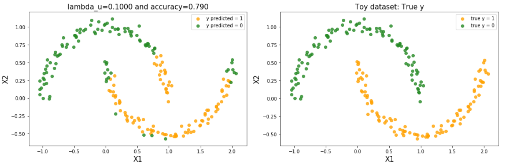
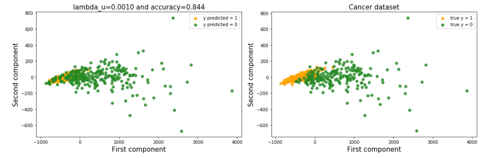

# Advanced-Machine-Learning
Machine Learning Class (Lectures and project) from the M2 Data Science

In this course, we studied most of traditional Machine learning problems and solutions we can find in the litterature. In particular, we saw:

- Trees (bagging & boosting)
- Kernel methods (RKHS theory)
- Unsupervised learning (clustering and dimension reduction)
- Spectral clustering, semi-supervised learning
- Graphs in machine learning

## Project : Spectral Clustering and Semi-Supervised Learning

The goal of this frst exercise is (i), to address clustering problems when data belong to some manifold,
(ii), to measure the impact of noise on spectral clustering and (iii), measure its stability especially when
the graph construction parameter varies.

